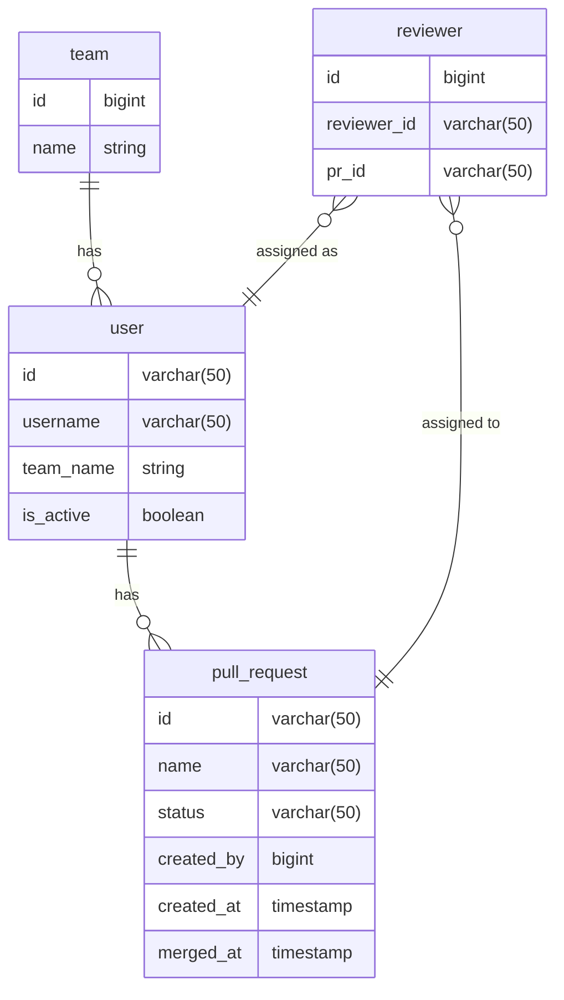

# pr-reviews-assignment-service

- Short description: the service providing simple to use API for managing Pr workflows inside teams. Detailed requirements are [here](https://github.com/avito-tech/tech-internship/blob/main/Tech%20Internships/Backend/Backend-trainee-assignment-autumn-2025/Backend-trainee-assignment-autumn-2025.md)

- Moreover that service is easy to set up and run. You should have only both [docker](https://www.docker.com/) and [docker-compose](https://docs.docker.com/compose/)


## Setup and run

- To use service clone project and just run
```bash
docker compose up -d
```
- After that you may test app by using swagger which is available on that [link](http://0.0.0.0:8080/swagger/index.html)

## Project template

- Project template is borrowed from this [one](https://github.com/evrone/go-clean-template). It helps to simplify code organization and follow 'clean architecture' principe
- More about that pattern you could read [here](https://blog.cleancoder.com/uncle-bob/2012/08/13/the-clean-architecture.html)

## Issues in the project

- There are endpoints using only one select query which is performed within one transaction.
It's not bad since transaction level in that case is `ReadCommitted` which is default level in postgres
- User stats: There were two ways to implement that endpoint: use aggregation query or create separated statistic table updating table via postgres triggers. The first way is chosen because app won't have big enough loading to make separated table and support it.
- Docker vs buildpack. I keep using buildpack instead of dockerfile for image building since
buildpack with its simple configuration provides multistage building, higher security, speeding up building and etc. automatically

## Performance tests

- `GET /api/v1/user/stats` is tested

- 3000 PRs, 600 users, 60 teams

- P(99) < 100ms

- [Benchmarks](./docs/performance/user_stats.jpg)

## ERD



## Did you like it?
- Tap star pls :innocent:
