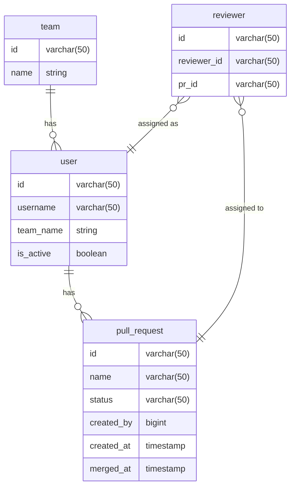

# ERD

```mermaid
 erDiagram

   team ||--o{ user: has
   user ||--o{ pull_request: has
   reviewer o{--|| user: "assigned as"
   reviewer o{--|| pull_request: "assigned to"

 user {
    id varchar(50)
    username varchar(50)
    team_name string
    is_active boolean
 }
 team {
    id varchar(50)
    name string
 }
 pull_request {
    id varchar(50)
    name varchar(50)
    status varchar(50)
    created_by bigint
    created_at timestamp
    merged_at timestamp
 }
 reviewer {
   id varchar(50)
   reviewer_id varchar(50)
   pr_id varchar(50)
 }

```
